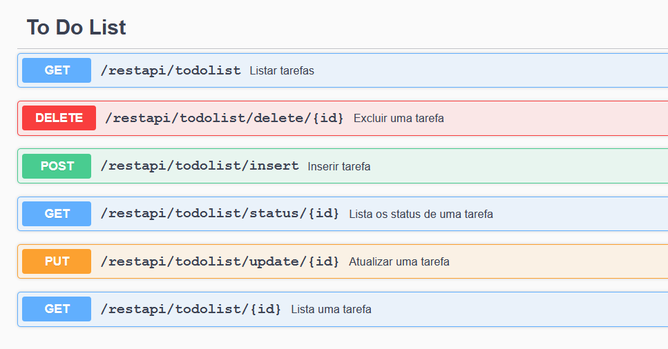

# Back-end

O projeto usa o [Quarkus](https://quarkus.io/) (Supersonic Subatomic Java Framework), Maven e o JDK 11.

## Comandos para a aplicação

Para executar o projeto em produção:
```shell script
./mvnw quarkus:dev
```

Para executar o projeto no ambiente de teste:
```shell script
./mvnw quarkus:dev -Dquarkus.profile=test
```

Para executar os testes de unidade, use:
```shell script
./mvnw clean test
```

Para fazer o build (packaging) do projeto, use:
```shell script
./mvnw package
```
Esse comando irá produzir o arquivo `back-end-1.0.0-SNAPSHOT-runner.jar` dentro da pasta `/target`.

Agora a aplicação pode ser executada assim: `java -jar target/back-end-1.0.0-SNAPSHOT-runner.jar`.


Para saber mais sobre como construir aplicações com Quarkus e Maven, você pode acessar: https://quarkus.io/guides/maven-tooling.html


## Documentação da API

Os endpoints iniciam com `http://localhost:8080/restapi/`.

Para ver a documentação dos endpoints da API, construída pelo Swagger, você pode acessar (com a aplicação em execução): `http://localhost:8080/swagger-ui/`


